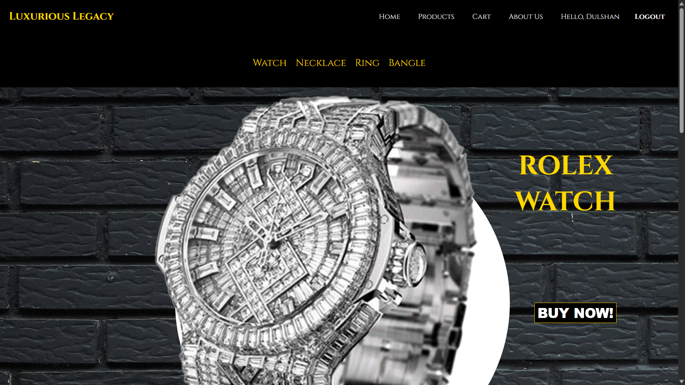
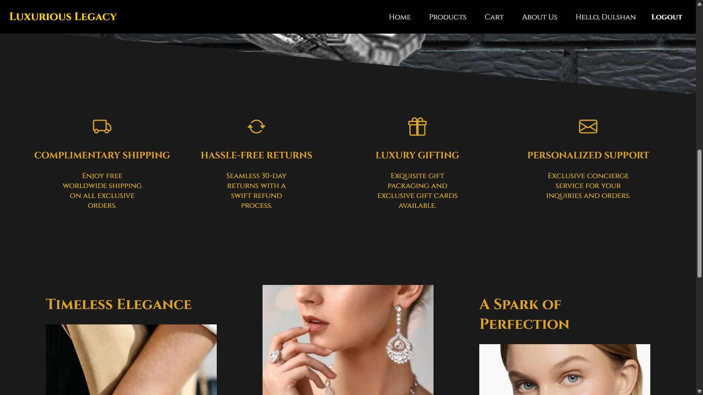
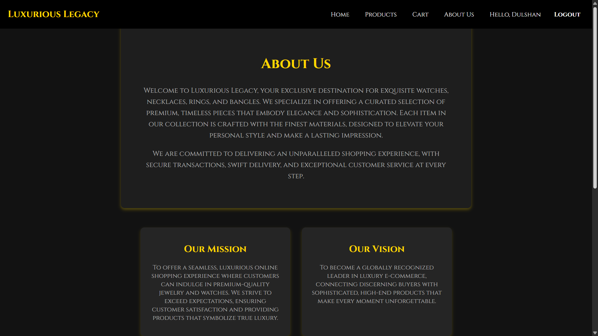
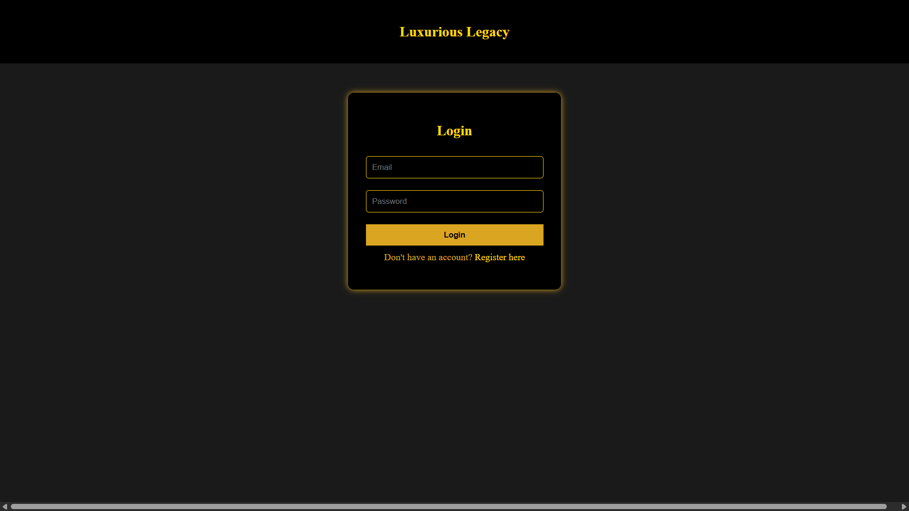
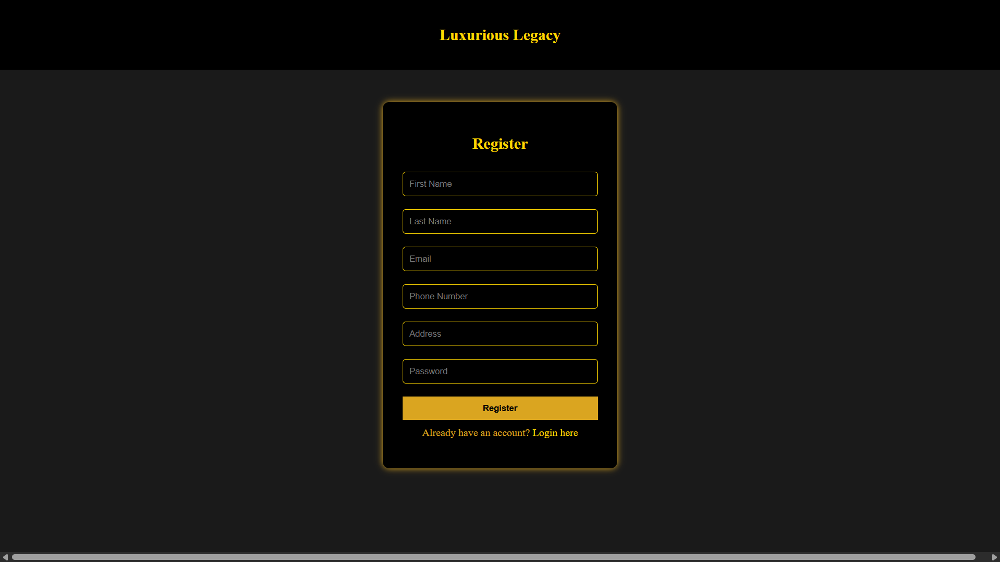
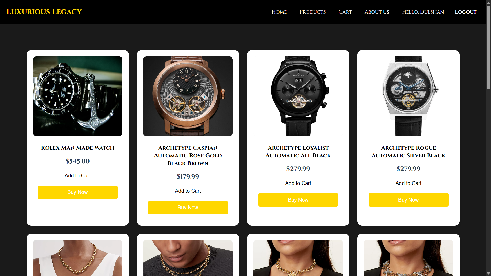
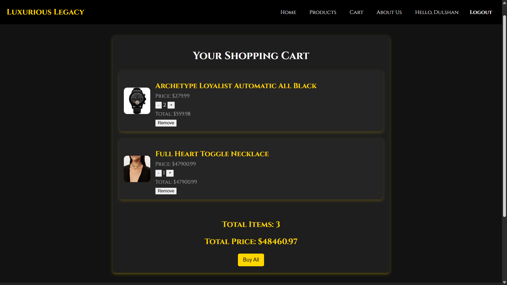
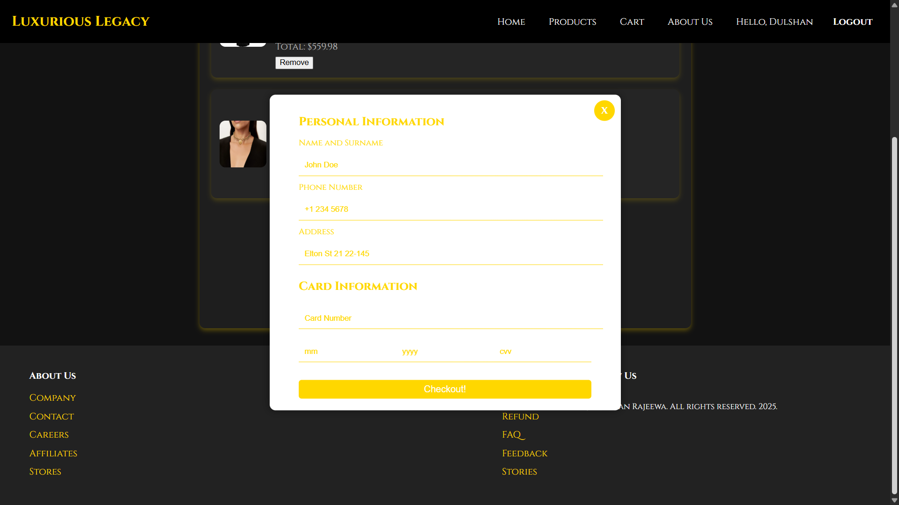
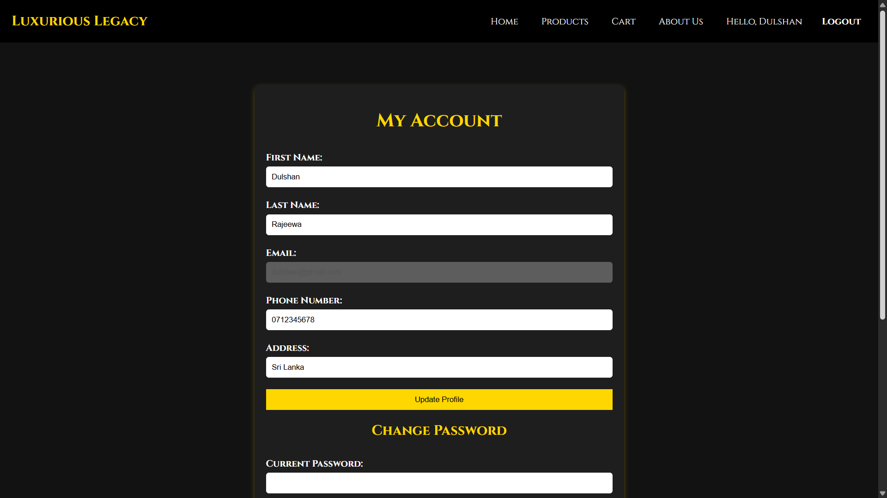
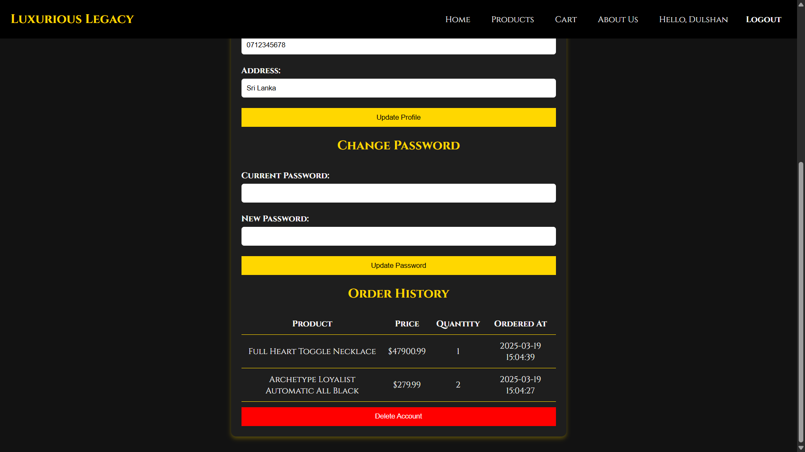

# 💎 Luxurious Legacy Store

Luxurious Legacy Store is a modern, PHP-based e-commerce website that specializes in selling luxury items including necklaces, rings, watches, and bangles. This application provides a full shopping experience — from browsing products to managing a shopping cart and completing a purchase with payment details.

---

## 🌐 Live Features

- 🏠 **Home Page** – Public landing page with a stylish layout  
- ℹ️ **About Us Page** – Company background and brand identity  
- 🔒 **Authentication** – User login and registration  
- 🛍️ **Products Page** – Browse products (only after login)  
- 🛒 **Cart System** – Add, update, or remove items in cart  
- 💳 **Buy Now** – Payment form popup for checkout  
- 👤 **User Profile** – View/edit personal details, change password, order history, delete account  
- 🚪 **Logout** – Ends session from any page via navbar  

---

## 📂 Project Structure


luxurious_legacy_store.sql  
luxurious-legacy-store/  
├── css/  
│ ├── registerStyles.css  
│ ├── Styles.css  
│ ├── StylesAbout.css  
│ ├── StylesAccount.css  
│ ├── StylesCart.css  
│ └── StylesProducts.css  
├── js/  
│ ├── index.js  
│ └── payment.js  
├── img/  
│ └── // image files  
├── about_us.php  
├── add_to_cart.php  
├── cart.php  
├── config.php  
├── footer.php  
├── index.php  
├── login.php  
├── logout.php  
├── navbar.php  
├── products.php  
├── register.php  
└── user_account.php  


---

## ✨ Features

- **Public Pages**:  
  - Home page and About Us page are accessible to all visitors.
  
- **Authentication System**:
  - Users must **register** and **login** to access product and cart features.

- **Product Page**:
  - View store products after logging in.
  - Add items to the cart.

- **Cart Page**:
  - View added products.
  - Update quantities or remove items.
  - Use **"Buy Now"** to access a popup **payment form** (card details, etc.).

- **User Account**:
  - View and edit personal details.
  - Change password.
  - View order history.
  - Delete account.

- **Logout Functionality**:
  - Secure logout available in the navigation bar.

---

## 🛠️ Tech Stack

- **Frontend**: HTML, CSS, JavaScript
- **Backend**: PHP
- **Database**: MySQL (`luxurious_legacy_store.sql`)

---

## 🚀 Getting Started

1. **Clone the repository**:
   ```bash
   git clone https://Dulshan-Rajeewa/luxury-jewelry-shop-php


2. **Import the database**:

   * Open **phpMyAdmin**.
   * Create a new database (e.g., `luxurious_legacy_store`).
   * Import the `luxurious_legacy_store.sql` file.

3. **Configure the database connection**:

   * Open `config.php`.
   * Set your DB username, password, and database name.

4. **Run the application**:

   * Place the project folder in your local server root (`htdocs` if using XAMPP).
   * Start Apache and MySQL.
   * Visit: `http://localhost/luxurious-legacy-store/`

---

## 📌 Notes

* Ensure JavaScript is enabled in the browser for payment form functionality.
* Customize styles and UI elements by editing the respective CSS files under `/css/`.

---

## 📄 License

This project is for educational and demonstration purposes.

---


## 👨‍💻 Author

Designed and developed by Dulshan Rajeewa

---

## 🖼️ Screenshots

### 🏠 Home Page



### 📝 About Us Page


### 🔐 Login Page


### 🧾 Register Page


### 💍 Products Page


### 🛒 Cart Page


### 💳 Payment Popup


### 👤 User Profile Page



